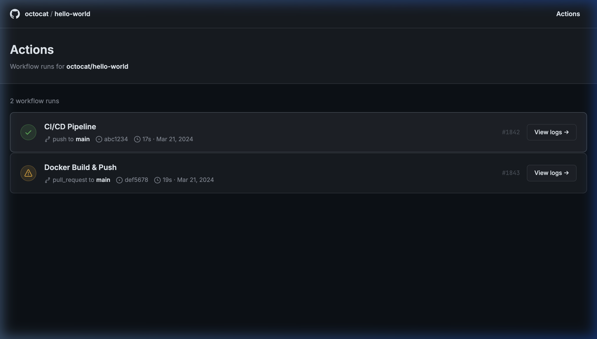
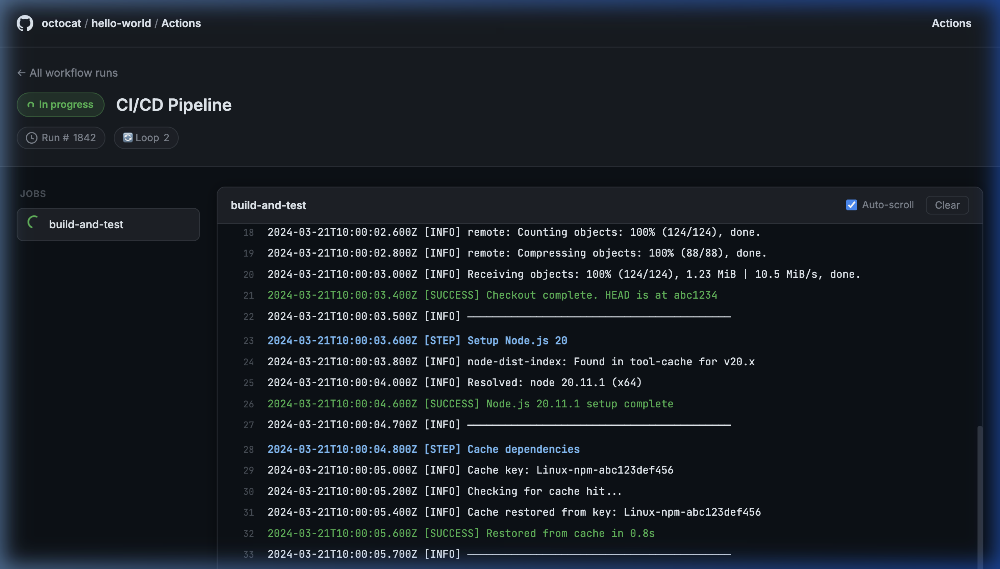

# GitHub Actions SSE Prototype

A full-stack, bare-metal prototype demonstrating Server-Sent Events (SSE) for streaming CI/CD workflow logs in real-time, exactly like GitHub Actions.

Built with **Zero Dependencies**: pure Java out-of-the-box (`com.sun.net.httpserver`) and standard HTML/CSS/JS.

## Features
- **Path-based SSE Routing:** Supports multiple concurrent workflow streams (e.g., Run #1842 and Run #1843).
- **GitHub Actions UI:** Dark theme, syntax-color-coded logs (blue for STEP, green for SUCCESS, yellow for WARNING).
- **Auto-scroll:** Keeps the viewer pinned to the bottom of the active stream.
- **Auto-reconnect:** `EventSource` automatically handles reconnections.

---

## How to Run

1. **Compile the server**
   ```bash
   mkdir -p out
   javac -d out src/SseServer.java
   ```

2. **Start the server**
   Run this from the root of the project:
   ```bash
   java -cp out SseServer
   ```

3. **Open in Browser**
   Navigate to the Home Page:
   👉 **http://localhost:3000**

   From there, you can click on any workflow run to see its live SSE stream in the viewer (`http://localhost:3000/viewer.html?runId=1842`).

---

## Screenshots

**Home Page** (Listing active/past runs)


**Live Log Viewer** (Streaming logs via SSE)


---

## Technical Details
Curious how it's built under the hood? Check out [SSE_EXPLAINED.md](./SSE_EXPLAINED.md) for a deep-dive into the raw HTTP format and the Java implementation.
